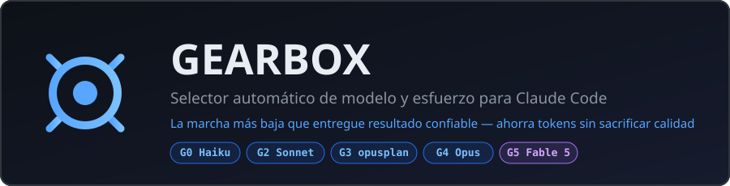
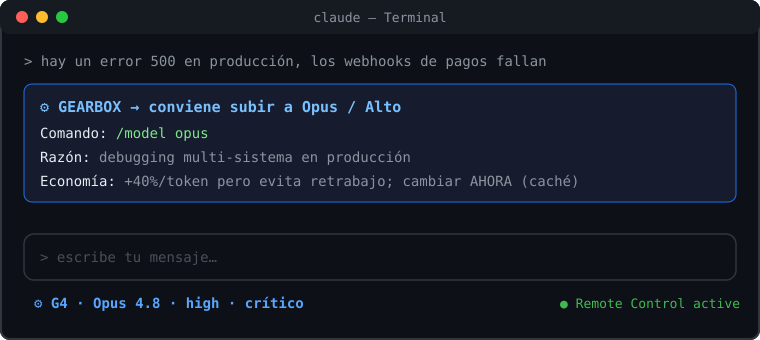

<div align="center">



**Deja de pagar precio de Opus por tareas de Haiku.**
Gearbox es un **recomendador de modelo y esfuerzo para Claude Code**: clasifica cada tarea,
te dice la marcha óptima con el comando exacto, delega lo rutinario automáticamente cuando puede,
y muestra la marcha activa en azul bajo tu terminal.

[](#-instalación)
[](LICENSE)
[](https://code.claude.com)

*Incluye soporte para **Claude Fable 5** (marcha G5) — el modelo más capaz de Anthropic.*

</div>

---

## 🎬 Así se ve



Escribes tu tarea → Gearbox la clasifica → si conviene otra marcha, **pausa y te lo dice antes de gastar**: comando exacto, razón en una frase, y cuánto ahorras (o cuánto cuesta no cambiar). La línea azul de abajo siempre muestra tu marcha, modelo real y esfuerzo.

## 🧭 No es otro statusline

La mayoría de herramientas para Claude Code te dicen **cuánto gastaste**. Gearbox intenta ayudarte a decidir **antes de gastar**.

| Herramienta | Punto fuerte | Modelos nuevos | Qué le falta frente a Gearbox |
|---|---|---|---|
| **ccusage statusline** | Costo real, gasto diario, burn rate, bloques de uso | Depende de su tabla de pricing y updates | Observa consumo; no recomienda cambiar de marcha por tarea |
| **Claude Powerline** | Statusline pulido, temas, costo, soporte de pricing para `claude-fable-5` | Sí incluye Fable 5 en pricing | Muestra estado; no clasifica intención ni propone `/model`/`/effort` |
| **CCometixLine** | Statusline robusto en Rust, TUI, reconocimiento flexible de modelos | Reconoce nuevas versiones por patrón, como Sonnet 5 | Buen display; no es un protocolo de decisión de costo/calidad |
| **claude-code-statusline** | Simple, directo, muestra modelo/tokens/costo | Más centrado en Sonnet 4.5/Opus/Haiku | No cubre Fable 5 ni routing por complejidad |
| **Claude Code nativo** | Aliases oficiales (`haiku`, `sonnet`, `opus`, `fable`, `best`, `opusplan`) | Sí, vía aliases oficiales | Te da las piezas; Gearbox pone la regla de decisión |

**Posicionamiento:** ccusage/Powerline/CCometixLine son tableros. Gearbox es el copiloto que te dice cuándo bajar, mantener o subir de modelo.

### Qué sí hace

- Recomienda la marcha correcta antes de empezar una tarea.
- Da el comando exacto: `/model opusplan`, `/model opus`, `/effort medium`, `claude --model fable`, etc.
- Explica la razón en una frase y el impacto económico estimado.
- Mantiene una bitácora para calibrar después con evidencia.

### Qué no promete

- No cambia el modelo principal sin el humano: Claude Code no expone un cambio automático universal para eso.
- No compite con dashboards de gasto: puede convivir con `ccusage` o Powerline.
- No activa Fable 5 solo: siempre requiere gate de costo explícito.

## ⚙ Instalación

**Opción A — 1 línea (recomendada):**

```bash
curl -fsSL https://raw.githubusercontent.com/GabrielMarquez01/gearbox-skill/master/install.sh | bash
```

**Opción B — manual:** clona el repo y corre `bash install.sh`, o copia los archivos según [instalación manual](#-instalación-manual).

Reinicia Claude Code y listo. El instalador hace **backup** de tu `settings.json` antes de tocarlo.

> Requisitos: Claude Code v2.1.170+ (`claude update`) · bash · python3 (para el merge seguro de settings). Sin más dependencias — los scripts son bash+sed puros, no necesitas jq.

## 🏎️ Las Marchas

> **Regla de oro:** usa la marcha más baja que entregue resultado confiable, y sube solo cuando el riesgo, dinero o complejidad lo justifique.

| Marcha | Para qué | Modelo · Esfuerzo | Cómo se activa | Economía |
|---|---|---|---|---|
| **G0 Rutina** | búsquedas, logs, formateo | Haiku · low | 🤖 automático (subagentes) | **−67%** vs Sonnet |
| **G1 Contenido** | copy, redacción, SEO | Sonnet · medium | `/effort medium` | −30-50% razonamiento |
| **G2 Ejecución** | features, UI, fixes | Sonnet · high | *default* | base |
| **G3 Planeación** | PRPs, features grandes | **opusplan** | `/model opusplan` → 🤖 Opus planea, Sonnet ejecuta, cambia solo | Opus solo al planear |
| **G3.5 Turno profundo** | 1 pregunta difícil | ultrathink | palabra `ultrathink` en el prompt | $0 de cambio |
| **G4 Crítico** | seguridad, producción caída | Opus · high | `/model opus` | +40% que se paga solo |
| **G5 Arquitectura** | ecosistema completo, infraestructura, decisiones multi-repo | **Fable 5** · max | `/model fable` o `claude --model fable` + gate de costo | 2× Opus |

Precios de referencia (jul 2026, por millón de tokens in/out): Haiku $1/$5 · Sonnet $3/$15 estándar (Sonnet 5 tiene intro $2/$10 hasta 2026-08-31 donde aplique) · Opus $5/$25 · **Fable 5 $10/$50**.

## 🧠 Cómo funciona

```
Tu prompt
   ↓
1. LEER     — Gearbox clasifica la tarea contra la tabla (costo ≈ $0, es parte de leer tu prompt)
2. COMPARAR — ¿marcha recomendada ≠ configuración actual?
   ├─ NO → trabaja directo, sin ruido
   └─ SÍ → 3. PAUSA + bloque ⚙ GEARBOX antes de gastar un token de más
   ↓
4. BITÁCORA — cada decisión queda en ~/.claude/gearbox/log.jsonl
   → con ~2 semanas de datos, Gearbox propone calibrar el esfuerzo de tus skills CON EVIDENCIA
```

**Los 3 errores de dinero que ataca:**
1. 💸 Correr todo en el modelo grande "por si acaso" → 40-400% extra en tareas que Sonnet/Haiku resuelven igual
2. 🔄 Correr lo difícil en el modelo barato → retrabajos que cuestan más que el ahorro
3. 👻 El invisible: cambiar de modelo **a mitad de sesión** reinicia el caché de prompt (descuento del 90% perdido — la siguiente respuesta relee TODO tu historial a precio completo). Gearbox recomienda en el momento correcto: al inicio de la tarea.

## 🔮 Fable 5 — la marcha G5

[Claude Fable 5](https://www.anthropic.com/news/claude-fable-5-mythos-5) es el modelo más capaz que Anthropic ha liberado (junio 2026, re-disponible desde julio tras los controles de exportación). Contexto de **1M tokens**, salida de 128k, hecho para tareas "más grandes que una sentada": arquitectura de sistemas, investigaciones de causa raíz, sesiones autónomas largas.

### Ventana Fable 5: úsalo con intención

Anthropic anunció que Fable 5 está disponible globalmente desde el **2026-07-01** en Claude Platform, Claude.ai, Claude Code y Claude Cowork. Para Pro, Max, Team y algunos planes Enterprise, está incluido hasta **50% de los límites semanales hasta el 2026-07-07**; después se usa vía créditos de uso si tu plan los tiene habilitados. Fuente: [Redeploying Fable 5](https://www.anthropic.com/news/redeploying-fable-5).

Eso no significa "úsalo para todo". Significa: si tienes acceso incluido, conviene gastarlo en decisiones que cambian la dirección del proyecto.

**Úsalo para:**
- Blueprint de arquitectura de un producto o ecosistema completo
- Infraestructura, seguridad, datos, integraciones y tradeoffs difíciles
- Analizar varios repos/documentos juntos sin perder contexto
- Encontrar causa raíz de bugs complejos o problemas de producción
- Convertir una visión ambigua en plan de ejecución por fases

**No lo uses para:**
- Copy, SEO, prompts simples o brainstorming ligero
- Fixes pequeños, formateo, renombres, logs o lectura mecánica
- Implementar tareas ya definidas que Sonnet puede ejecutar bien
- Preguntas que se validan mejor con usuarios reales que con más razonamiento

Prompt recomendado para G5:

```text
Estoy usando Fable 5. No implementes todavía.
Analiza el contexto completo y dame:
1. arquitectura recomendada,
2. riesgos y tradeoffs,
3. plan por fases,
4. qué debe ejecutar Sonnet,
5. qué puede delegarse a Haiku,
6. cuándo tendría sentido volver a Fable.
```

Gearbox lo trata como marcha especial:
- **Nunca se activa solo** — siempre con gate de costo explícito (es 2× Opus: $10/$50)
- Se usa idealmente al inicio de una sesión dedicada (`/model fable` o `claude --model fable`), no a mitad de una tarea larga
- El punto dulce: cargar tu ecosistema, restricciones y objetivos en el contexto de 1M y pedirle el blueprint completo
- Si el tema toca ciberseguridad o biología, puede haber rechazos o fallback por clasificadores de seguridad; no es una falla de Gearbox

También existe el alias `best`: usa Fable si tu organización tiene acceso, si no el mejor Opus.

### ¿Y Claude Mythos 5?

Mythos 5 es **el mismo modelo que Fable 5 pero con salvaguardas levantadas** en ciertas áreas (ciberseguridad ofensiva, biología). **No es de acceso público y no tiene auto-enrolamiento**:

- Restringido a **partners de [Project Glasswing](https://www.anthropic.com/project/glasswing)** (equipos de ciberdefensa e infraestructura crítica) e investigadores de biología seleccionados
- Requiere acuerdos formales bajo ASL-4, vetting de personal, auditoría continua y retención obligatoria de 30 días del tráfico
- El camino: contactar a tu account team de Anthropic, AWS o Google Cloud y pasar la aprobación

**Para el 99.9% de desarrolladores: Fable 5 ES el techo.** Si Fable rechaza una solicitud legítima de seguridad (sus clasificadores re-rutean a Opus 4.8 automáticamente), esa es la señal de que tu caso de uso requeriría el programa Glasswing.

## ❓ FAQ

<details><summary><b>¿Cambia el modelo de mi sesión automáticamente?</b></summary>

Lo que puede ser automático, lo es: las subtareas rutinarias van a Haiku vía subagentes sin preguntarte, y `opusplan` cambia solo entre Opus (planear) y Sonnet (ejecutar). El modelo **principal** de la sesión solo puede cambiarlo el humano — no existe API para que Claude se cambie a sí mismo — por eso Gearbox te da el comando exacto listo para copiar.
</details>

<details><summary><b>¿Gearbox es oficial de Anthropic?</b></summary>

No. Gearbox es un proyecto open-source independiente de OpenGravity/Gabriel Marquez. Usa piezas oficiales de Claude Code como `statusLine`, aliases de modelo, skills, subagentes y comandos `/model`/`/effort`, pero no está afiliado ni respaldado por Anthropic.
</details>

<details><summary><b>¿Es seguro instalarlo con curl | bash?</b></summary>

El instalador solo copia `SKILL.md`, `README.md`, `statusline.sh` y `reset.sh` a `~/.claude`, crea backup de `settings.json`, registra `statusLine` y agrega una directiva a `CLAUDE.md`. Aun así, si prefieres revisar antes de ejecutar, clona el repo y corre `bash install.sh` manualmente.
</details>

<details><summary><b>¿La ventana de Fable 5 hasta el 2026-07-07 significa uso gratis ilimitado?</b></summary>

No. Anthropic anunció inclusión hasta 50% de límites semanales para Pro, Max, Team y algunos Enterprise hasta el 2026-07-07. No es ilimitado, puede depender del plan y después requiere usage credits si tu cuenta los tiene habilitados. Gearbox lo menciona como oportunidad temporal, no como promesa permanente.
</details>

<details><summary><b>¿Por qué no usar Fable 5 para todo mientras esté disponible?</b></summary>

Porque Fable 5 cuesta más, consume límites más rápido y su valor real está en decisiones difíciles: arquitectura, infraestructura, raíz de bugs complejos y contexto grande. Para implementación normal, Sonnet suele ser mejor equilibrio. Para rutina, Haiku o subagentes baratos son suficientes.
</details>

<details><summary><b>¿Qué pasa si Fable 5 rechaza una tarea?</b></summary>

Fable 5 tiene clasificadores de seguridad más estrictos, especialmente en áreas como ciberseguridad o biología. Puede rechazar o hacer fallback a otro modelo. Eso no rompe Gearbox: simplemente significa que conviene seguir con Opus/Sonnet o reformular la tarea de forma defensiva y legítima.
</details>

<details><summary><b>¿Funciona con plan Pro/Max o solo con API?</b></summary>

Ambos. Con suscripción, el "ahorro" se traduce en consumir tus límites más lento (Fable consume ~2× más rápido que Opus; Haiku muchísimo menos que Sonnet). Con API, es dinero directo.
</details>

<details><summary><b>¿Cuánto ahorra realmente?</b></summary>

Depende de tu mezcla de tareas. Referencia: si hoy corres todo en Opus y tu trabajo es 70% ejecución/rutina, mover eso a Sonnet/Haiku ahorra ~40-60% del gasto total. El error inverso (todo en barato) cuesta en retrabajos — por eso Gearbox también recomienda **subir**.
</details>

<details><summary><b>¿Qué es opusplan?</b></summary>

Un alias oficial de Claude Code: usa Opus durante el modo plan (razonamiento/arquitectura) y cambia automáticamente a Sonnet al ejecutar. El arquitecto diseña, los albañiles construyen — y no pagas al arquitecto por poner ladrillos. Actívalo con `/model opusplan`.
</details>

<details><summary><b>¿Qué es ultrathink?</b></summary>

Una palabra clave: escríbela en cualquier prompt y ese turno razona más profundo, sin cambiar modelo ni configuración. Perfecta para UNA pregunta difícil aislada — la marcha G3.5.
</details>

<details><summary><b>¿No tengo acceso a Fable 5, se rompe algo?</b></summary>

No. G5 es una recomendación con comando — si no tienes acceso, el picker no lo mostrará y usas Opus (G4). El alias `best` resuelve esto solo.
</details>

<details><summary><b>El statusline azul no aparece</b></summary>

1. Reinicia Claude Code (la configuración carga al inicio). 2. Verifica que `~/.claude/settings.json` tenga el bloque `statusLine`. 3. Prueba el script a mano: `echo '{"model":{"display_name":"Test"}}' | bash ~/.claude/gearbox/statusline.sh` — debe imprimir la línea azul.
</details>

<details><summary><b>¿El instalador rompe mi settings.json?</b></summary>

No: hace **merge** (preserva tus hooks, permisos y preferencias) y guarda backup en `settings.json.backup-gearbox`. Si ya tenías `model` configurado, lo respeta.
</details>

<details><summary><b>¿Windows / WSL / macOS / Linux?</b></summary>

WSL, macOS y Linux: soportado (bash + sed + python3, presentes por defecto). Windows nativo (PowerShell): los scripts requieren Git Bash o WSL.
</details>

<details><summary><b>¿Y cuando salgan modelos nuevos?</b></summary>

Dos niveles: (1) versiones nuevas — Gearbox usa **alias** (`sonnet`, `opus`, `haiku`, `fable`), que Anthropic apunta siempre a la última versión, cero mantenimiento; (2) categorías nuevas — el protocolo incluye un *model watch* mensual: Gearbox consulta la página oficial de modelos y te propone integrar lo nuevo a la tabla, con tu aprobación.
</details>

<details><summary><b>¿Cómo se calibra con mis datos?</b></summary>

Cada clasificación se registra en `~/.claude/gearbox/log.jsonl`. Con ~2 semanas de uso, Gearbox propone niveles de esfuerzo por skill (frontmatter `effort:`) con la evidencia de cada una. Nada cambia sin tu OK.
</details>

<details><summary><b>¿Cómo desinstalo?</b></summary>

```bash
rm -rf ~/.claude/gearbox ~/.claude/skills/gearbox
mv ~/.claude/settings.json.backup-gearbox ~/.claude/settings.json
# y borra la sección "## Gearbox" de ~/.claude/CLAUDE.md
```
</details>

## 📦 Instalación manual

```bash
git clone https://github.com/GabrielMarquez01/gearbox-skill.git
cd gearbox-skill
bash install.sh
```

O a mano: `SKILL.md` → `~/.claude/skills/gearbox/` · `statusline.sh` y `reset.sh` → `~/.claude/gearbox/` (con `chmod +x`) · registra `statusLine` y el hook `SessionStart` en `~/.claude/settings.json` · agrega la directiva Gearbox a `~/.claude/CLAUDE.md` (ver [install.sh](install.sh) como referencia exacta).

## 🗺️ Estructura

```
~/.claude/skills/gearbox/SKILL.md   ← el cerebro: tabla, protocolo, calibración, model watch
~/.claude/gearbox/statusline.sh     ← indicador azul (bash+sed puro)
~/.claude/gearbox/reset.sh          ← hook SessionStart → marcha default
~/.claude/gearbox/state.json        ← marcha activa
~/.claude/gearbox/log.jsonl         ← bitácora de calibración
```

## 🤝 Contribuir

PRs bienvenidos: marchas nuevas, calibraciones con evidencia, ports (PowerShell), traducciones. Si Gearbox te ahorró dinero, una ⭐ ayuda a que más gente deje de quemar tokens.

## Licencia

[MIT](LICENSE) — Gabriel Marquez / [OpenGravity](https://github.com/GabrielMarquez01/OpenGravity), 2026.

---

<div align="center"><sub>⚙ <b>Gearbox</b> — evolución del Gearbox Protocol de OpenGravity · construido con la filosofía SaaS Factory: usar → medir → calibrar</sub></div>
