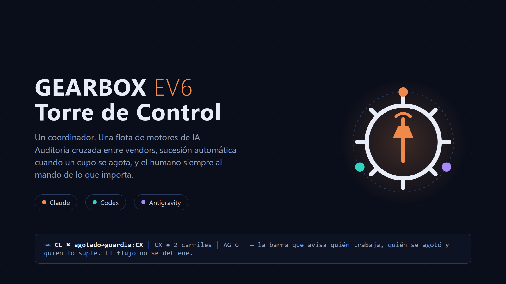
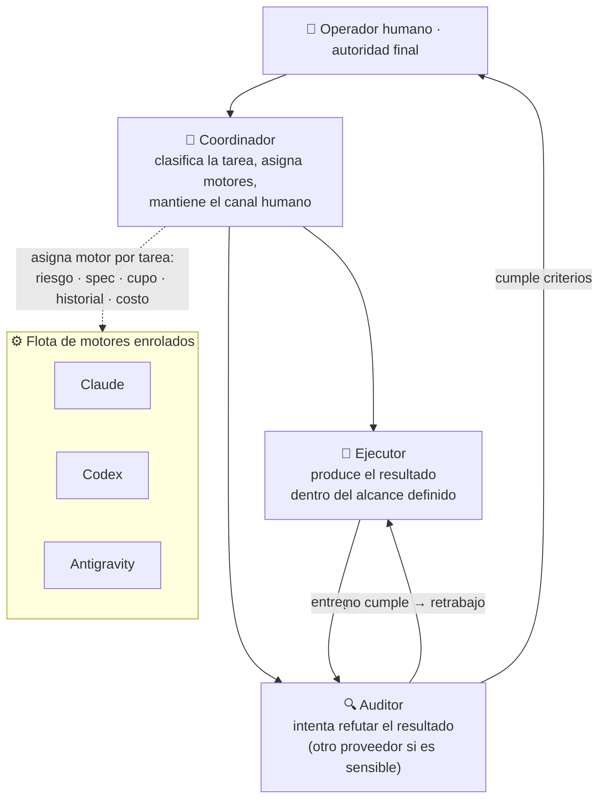
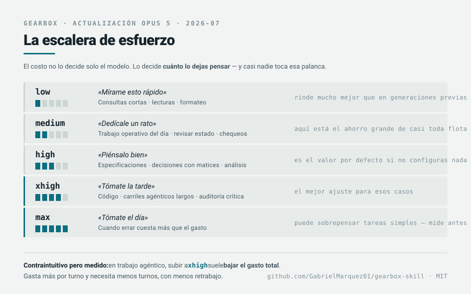

<div align="center">



# Gearbox

**La marcha correcta y el motor correcto para cada tarea de IA — con auditoría cruzada y el humano como autoridad final.**

[](LICENSE)
[](docs/GEARBOX-EV6-MULTI-MOTOR.md#13-estado-y-alcance-del-proyecto)
[](docs/GEARBOX-EV6-MULTI-MOTOR.md)
[](#-contribuir--reportar-resultados)

</div>

---

Gearbox nació como un **skill para Claude Code** que clasifica cada tarea en una *marcha* de esfuerzo (G0–G5) y recomienda el modelo y el razonamiento adecuados **antes de gastar** — para dejar de pagar precio de modelo grande por trabajo de modelo chico, y de pagar retrabajos por correr lo difícil en el modelo barato.

**Gearbox EV6** es su evolución: una *torre de control* para equipos de IA **multi-motor**. Un coordinador asigna trabajo a distintos motores —hoy Claude, Codex y Antigravity— según tipo de tarea, esfuerzo, disponibilidad y desempeño medido. Todo flujo autónomo exige dos roles separados (**ejecutor + auditor**), y lo sensible —dinero, legal, fiscal, datos personales— exige **auditoría cruzada entre proveedores** y aprobación humana. En su primer día operativo, una auditoría cruzada con Codex detectó una omisión fiscal real (Regla Miscelánea 3.13.7) que la revisión primaria no vio.

Esto es **infraestructura temprana y honesta**: no comparte cuentas ni sesiones entre agentes, no promete que dos modelos siempre acierten, y documenta sus fricciones reales (sandbox de Windows, autorización headless, cupos poco visibles) para que sean **reproducibles y medibles**, no para esconderlas.

## 📑 Índice

- [Quick Start](#-quick-start)
- [Cómo se organiza la flota](#-cómo-se-organiza-la-flota)
- [Las marchas G0–G5](#-las-marchas-g0g5)
- [¿Cuánto rinde? — con y sin Gearbox](#-cuánto-rinde--la-misma-cuenta-con-y-sin-gearbox) *(actualización Opus 5)*
- [Comparativa de motores](#-comparativa-de-motores) *(colapsable)*
- [FAQ](#-faq) *(colapsable)*
- [Documentación](#-documentación)
- [Contribuir / reportar resultados](#-contribuir--reportar-resultados)
- [Licencia](#-licencia)

**Documento técnico completo:** [Gearbox EV6 — Torre de Control multi-motor](docs/GEARBOX-EV6-MULTI-MOTOR.md)
→ [Qué problema resuelve](docs/GEARBOX-EV6-MULTI-MOTOR.md#1-qué-problema-intenta-resolver) · [Arquitectura en 5 minutos](docs/GEARBOX-EV6-MULTI-MOTOR.md#2-arquitectura-en-cinco-minutos) · [Guía de replicación](docs/GEARBOX-EV6-MULTI-MOTOR.md#4-guía-de-replicación) · [Modo mono-motor](docs/GEARBOX-EV6-MULTI-MOTOR.md#5-modo-mono-motor-empezar-solo-con-claude-code) · [El primer día (caso real)](docs/GEARBOX-EV6-MULTI-MOTOR.md#6-el-primer-día-una-omisión-fiscal-detectada-por-auditoría-cruzada) · [Fricciones reales](docs/GEARBOX-EV6-MULTI-MOTOR.md#8-fricciones-reales-encontradas) · [Cómo evaluar tu réplica](docs/GEARBOX-EV6-MULTI-MOTOR.md#10-cómo-evaluar-tu-propia-réplica) · [Invitación a la comunidad](docs/GEARBOX-EV6-MULTI-MOTOR.md#12-invitación-a-la-comunidad)

## 🚀 Quick Start

Gearbox se adopta **por capas**. No necesitas tres motores el primer día — la capa base funciona completa con solo Claude Code, y un segundo motor se suma cuando exista un caso real ([por qué](docs/GEARBOX-EV6-MULTI-MOTOR.md#5-modo-mono-motor-empezar-solo-con-claude-code)).

### Capa 1 — Mono-motor (Claude Code)

Instala el skill Gearbox (marchas G0–G5, statusline, bitácora de calibración):

```bash
curl -fsSL https://raw.githubusercontent.com/GabrielMarquez01/gearbox-skill/master/install.sh | bash
```

Reinicia Claude Code y listo. El instalador hace **backup** de tu `settings.json` antes de tocarlo. Si prefieres revisar antes de ejecutar: clona el repo y corre `bash install.sh`. Detalle completo del skill en el [README clásico](README-viejo.md).

> Requisitos: Claude Code v2.1.170+ (`claude update`) · bash · python3. Los scripts son bash+sed puros.

### Capa 2 — Multi-motor (opcional)

Cada motor se instala y autentica **por separado, personalmente** — nunca se comparten cuentas, cookies ni archivos de sesión ([regla humana obligatoria](docs/GEARBOX-EV6-MULTI-MOTOR.md#43-autenticación-regla-humana-obligatoria)).

1. **Codex CLI** — instálalo desde la fuente oficial de OpenAI e inicia sesión con tu propia cuenta. Invocación headless verificada (2026-07-15/16, solo lectura):

   ```bash
   codex exec --sandbox read-only
   ```

2. **Antigravity CLI** — instalador oficial de Google, verificado 2026-07-15/16:

   ```bash
   curl -fsSL https://antigravity.google/cli/install.sh | bash
   ```

   Prueba headless verificada (requiere *allow-rules* de permisos; su configuración completa es una limitación conocida):

   ```bash
   agy --sandbox --print "prompt"
   ```

3. **Enrola cada motor** solo después de verificar invocación, modos, límites y costo — el [contrato mínimo de enrolamiento](docs/GEARBOX-EV6-MULTI-MOTOR.md#49-contrato-mínimo-para-enrolar-un-motor) tiene la plantilla.

> [!WARNING]
> Los comandos, instaladores y opciones de CLI envejecen. Verifica siempre la sintaxis vigente contra la documentación oficial de cada proveedor. Empieza con un repositorio de prueba y tareas reversibles — nunca con un pago, un deploy de producción ni una interpretación legal real.

## 🗼 Cómo se organiza la flota

Los **puestos** (responsabilidades) están separados de los **motores** (Claude, Codex, Antigravity). Los puestos se asignan por evidencia de desempeño, no por preferencia de marca — y pueden rotar con datos.



Dos puestos más completan la continuidad: el **suplente** mantiene el flujo cuando el titular no está disponible, y la **guardia** conserva operaciones limitadas si el coordinador se queda sin cupo — sin poder desplegar, autorizar gastos, ejecutar pagos ni ampliar el alcance ([sucesión meritocrática](docs/GEARBOX-EV6-MULTI-MOTOR.md#22-sucesión-meritocrática)).

## 🏎️ Las marchas G0–G5

Cada tarea se clasifica en **dos ejes**: `marcha de esfuerzo × motor asignado`. La marcha representa esfuerzo, riesgo o profundidad de razonamiento — no el motor: una tarea G2 puede ejecutarse con distintos motores.

| Marcha | Uso orientativo |
|---|---|
| **G0** | Operación mecánica o consulta trivial |
| **G1** | Redacción o transformación simple |
| **G2** | Construcción con especificación clara |
| **G3** | Trabajo ambiguo o con varias dependencias |
| **G4** | Auditoría crítica, dinero, legal, fiscal o privacidad |
| **G5** | Decisión arquitectónica o sistémica de alto impacto |

> **Regla de oro:** usa la marcha más baja que entregue resultado confiable, y sube solo cuando el riesgo, dinero o complejidad lo justifique. Para dinero, legal, fiscal o datos personales, la eficiencia **nunca** elimina la revisión cruzada ni la aprobación humana.

La implementación concreta para Claude Code (comandos `/model` y `/effort`, statusline, multiplicadores de costo) está en el [README clásico del skill](README-viejo.md) y en [SKILL.md](SKILL.md).

---

## 💸 ¿Cuánto rinde? — la misma cuenta, con y sin Gearbox

> **Actualización Opus 5 (2026-07):** Opus 5 llega al mismo precio que su antecesor, pero cambió lo
> que más pesa en la factura — el **esfuerzo**. `low` y `medium` rinden ahora inusualmente bien, y
> `xhigh` es el mejor ajuste para código. Eso convierte al esfuerzo en **la palanca principal de
> costo**, no en un ajuste fino.



### El experimento: $100 USD de saldo

La pregunta honesta que todo el mundo se hace: *si Opus 5 es tan bueno, ¿por qué no correr todo en
Opus 5 y ya?* Aquí está la respuesta en dinero.

**Supuestos** (declarados para que puedas rehacer el cálculo con los tuyos): tarea unitaria de
**20 000 tokens de entrada**; salida —razonamiento incluido— de **1 k** en `low`, **3 k** en
`medium`, **6 k** en `high` y **12 k** en `xhigh`; tarifas estándar de lista.

| Estrategia | Costo por tarea | **Tareas con $100** |
|---|---:|---:|
| Todo en el modelo de frontera · `high` | $0.500 | **200** |
| **Todo en Opus 5 · `high`** *(el "no pienses, usa el mejor")* | $0.250 | **400** |
| **Con Gearbox** *(mezcla por marcha)* | $0.115 | **871** |

**Mismo dinero, 2.2× más trabajo.** No porque el Gearbox use modelos peores — sino porque deja de
pagar precio de razonamiento profundo para tareas que no lo necesitan.

<details>
<summary>Ver la mezcla usada y el desglose</summary>

| Marcha | % del trabajo | Configuración | Costo/tarea |
|---|---:|---|---:|
| G0 · mecánico | 40% | Haiku · `low` | $0.025 |
| G1–G2 · operativo | 35% | Sonnet · `medium` | $0.105 |
| G2–G3 · construcción | 20% | Sonnet · `xhigh` | $0.240 |
| G4 · crítico | 5% | Opus · `xhigh` | $0.400 |

Promedio ponderado: **$0.115 por tarea**.

**¿Y si el modelo barato se equivoca?** Es la objeción correcta. Supongamos que **una de cada cinco**
tareas mecánicas sale mal y hay que rehacerla en Sonnet: el promedio sube a $0.123 y todavía rinden
**812 tareas** — sigue siendo **2×**. El margen aguanta bastante error antes de desaparecer.

</details>

### Cuatro escenarios reales

**1 · Operación con mucho trabajo mecánico** — buscar en archivos, leer logs, renombrar, clasificar,
formatear. *El Gearbox gana en grande:* ese trabajo cuesta 10× menos en el modelo ligero y **el
resultado es idéntico**. Aquí es donde aparece la mayor parte del 2.2×.

**2 · Taller de código pesado** — casi todo es construcción compleja que necesita `xhigh` de todas
formas. *El Gearbox gana poco en dinero… y mucho en calidad:* su aporte aquí no es abaratar, es
decirte que **subas** a `xhigh` en vez de quedarte en el default. Menos turnos, menos retrabajo.

**3 · Auditoría de dinero, seguridad o datos personales** — *aquí el Gearbox te hace gastar MÁS a
propósito*, y ésa es la ganancia. Un cobro mal calculado o una fuga de datos cuesta más que la
cuenta entera del mes. **Los gates suben; nunca bajan para ahorrar.**

**4 · Uso esporádico** — si haces diez tareas al mes, la disciplina no te va a devolver el tiempo
que inviertes en aplicarla. *Usa el mejor modelo y sigue con tu vida.* El Gearbox rinde cuando hay
volumen o cuando hay riesgo — si no tienes ninguno de los dos, no lo necesitas.

### Si tu plan ya incluye el modelo

Con suscripción, el ahorro **no llega como factura más baja: llega como más trabajo antes de topar
tu límite**. La aritmética es la misma y la conclusión también — pero se siente distinto: no ves
dinero de vuelta, ves que **dejas de quedarte sin cupo a media tarde**.


## ⚖️ Comparativa de motores

<details>
<summary><b>Los tres motores enrolados hoy — puestos, autenticación y estado verificado</b></summary>

<br>

Asignaciones **iniciales**, en calibración — la sucesión es meritocrática y se revisa con evidencia, no con anécdotas.

| | Claude (Anthropic) | Codex (OpenAI) | Antigravity (Google) |
|---|---|---|---|
| **Puesto inicial** | Coordinador | Ejecutor / auditor / suplente | Ejecutor / auditor / suplente (tercer motor enrolado) |
| **Cuenta requerida** | Cuenta propia compatible con Claude Code | Suscripción propia de ChatGPT que habilite Codex CLI | Cuenta propia de Google compatible |
| **Invocación verificada (2026-07-15/16)** | Claude Code (flujo oficial) | `codex exec --sandbox read-only` | `agy --sandbox --print "prompt"` |
| **Fricción conocida** | — | Sandbox de Windows; desde WSL puede requerir wrapper de PowerShell | Autorización headless pendiente de configuración completa (*allow-rules*) |
| **Rol en este mismo repo** | Coordinación y auditoría del doc EV6 | Redacción del doc EV6; auditor cruzado del caso fiscal | Tercer motor enrolado en la flota |

Roles **restringidos por defecto para todos los motores**: aprobador financiero, aprobador legal, despliegue a producción. Eso lo decide el humano, siempre.

Ninguna de estas asignaciones es permanente: se comparan resultados por `clase de tarea + marcha + rol + entorno` y los cambios de titular se proponen con evidencia y aprobación humana ([cómo evaluar](docs/GEARBOX-EV6-MULTI-MOTOR.md#10-cómo-evaluar-tu-propia-réplica)).

</details>

## ❓ FAQ

<details>
<summary><b>¿Gearbox es oficial de Anthropic, OpenAI o Google?</b></summary>

No. Es un proyecto open-source independiente de OpenGravity / Gabriel Marquez. Usa piezas oficiales de cada CLI (statusline, aliases de modelo, skills, comandos), pero no está afiliado ni respaldado por ningún proveedor.
</details>

<details>
<summary><b>¿Necesito los tres motores para empezar?</b></summary>

No. La capa base funciona completa con un solo motor (por ejemplo Claude Code): marchas G0–G5, roles ejecutor/auditor con agentes distintos del mismo proveedor, tablero de estados y ventanilla humana. Multi-motor es una evolución opcional que se suma cuando existe un caso real — auditoría cruzada de contenido sensible o continuidad cuando el motor principal se queda sin cupo. Detalle: [modo mono-motor](docs/GEARBOX-EV6-MULTI-MOTOR.md#5-modo-mono-motor-empezar-solo-con-claude-code).
</details>

<details>
<summary><b>¿Comparte cuentas o sesiones entre los agentes?</b></summary>

Nunca. Cada CLI se autentica por separado mediante el flujo oficial del proveedor, y el login lo completa personalmente el operador humano. Prohibido: copiar cookies, pegar tokens en prompts, compartir archivos de sesión o automatizar credenciales en el repo. [Regla completa](docs/GEARBOX-EV6-MULTI-MOTOR.md#43-autenticación-regla-humana-obligatoria).
</details>

<details>
<summary><b>¿Los agentes pueden aprobar pagos, deploys o decisiones legales?</b></summary>

No. Toda tarea relacionada con dinero, fiscalidad, asuntos legales o datos personales necesita auditoría cruzada entre proveedores **y** decisión humana final. Ni siquiera el modo guardia (continuidad cuando se agota el cupo) puede desplegar, autorizar gastos o ampliar el alcance.
</details>

<details>
<summary><b>¿Dos modelos garantizan una respuesta correcta?</b></summary>

No, y el proyecto no lo promete. La promesa comprobable es más modesta: si se separan los roles, se conserva la trazabilidad y se mide el resultado, un equipo multi-motor puede detectar errores diferentes, resistir mejor el agotamiento de cupos y reducir la dependencia de un solo proveedor. Esa hipótesis se sigue probando con datos de la comunidad.
</details>

<details>
<summary><b>¿Es seguro instalar el skill con curl | bash?</b></summary>

El instalador copia los archivos del skill a `~/.claude`, crea backup de `settings.json` y registra el statusline. Si prefieres revisar antes de ejecutar, clona el repo y corre `bash install.sh` manualmente. Detalle en el [README clásico](README-viejo.md).
</details>

<details>
<summary><b>¿Qué pasa cuando un motor se queda sin cupo?</b></summary>

Entra la sucesión: un suplente con especificación escrita mantiene el flujo, o el modo guardia conserva operaciones limitadas (continuar trabajos ya especificados, documentar avances, informar al humano) sin heredar los poderes del titular. Por eso cada tarea lleva una [especificación mínima](docs/GEARBOX-EV6-MULTI-MOTOR.md#410-especificación-mínima-de-una-tarea) que otro motor pueda retomar.
</details>

## 🎁 Gratis y mejorado por la comunidad

Gearbox es software gratuito bajo licencia MIT y **puede funcionar completamente
en local**. Su *Community Learning Program* mejora las recomendaciones usando
métricas anónimas y agregadas aportadas voluntariamente por quienes lo usan.
Antes de enviar, Gearbox minimiza los datos, elimina identificadores, escanea
secretos, te deja revisar la cápsula y exige tu consentimiento. **Nunca envía
prompts, respuestas, código, archivos, nombres de proyectos ni credenciales.**
Quien no desee contribuir puede usar el modo local o un colector autoalojado.

La licencia **no** está condicionada a enviar datos.

```text
Tu equipo
  ↓ métricas locales
Sanitizador  (elimina identificadores · generaliza a bandas · escanea secretos)
  ↓
Vista previa y consentimiento     ← aquí decides tú
  ↓ cápsula gzip
Colector
  ↓
Agregación con umbral   (n ≥ 20 eventos y ≥ 5 contribuyentes distintos)
  ↓
Community Priors
  ↓
Mejores predicciones para la comunidad
```

### Lo que Gearbox nunca recopila

prompts · respuestas · código · archivos · fragmentos de documentos · hashes de
prompts · task_id locales · session_id · rutas · nombres de repositorio · rama ·
commit · nombres de archivo · URLs · IP · correo · teléfono · hostname ·
usuario · tokens · llaves API · secretos · cookies · texto libre · stack traces
· marcas de tiempo exactas · geografía.

Tampoco acepta —ni con consentimiento— datos de menores, salud, biometría,
religión, origen étnico, ubicación precisa ni información financiera personal.

### Cómo verificarlo tú mismo

No hace falta creernos:

```bash
# Ver el texto exacto que saldría de tu equipo, antes de enviar nada
~/.claude/gearbox/gearbox.py telemetry preview

# Guardarlo y revisarlo con tus propias herramientas
~/.claude/gearbox/gearbox.py telemetry export --out /tmp/capsula.json
grep -iE 'prompt|path|home|token|@|http' /tmp/capsula.json    # no debe salir nada

# Comprobar que el modo local NO abre ninguna conexión
python3 -m unittest tests.test_compat_transport.LocalModeIsOfflineTests -v

# Ver el estado completo: modo, consentimiento, cola, priors
~/.claude/gearbox/gearbox.py telemetry status
```

Y para salir cuando quieras:

```bash
gearbox.py telemetry disable   # detener envíos
gearbox.py telemetry purge     # vaciar la cola
gearbox.py telemetry revoke    # revocar, borrar la cola y rotar el seudónimo
```

> **Estado honesto:** hoy **no existe** un colector público — no hay dominio,
> endpoint ni token de ingesta. Lo que existe es una implementación de
> referencia auto-alojable en [`collector/`](collector/README.md). En la
> práctica, las opciones reales hoy son **local** y **self-hosted**.
> Detalle completo en [TELEMETRY.md](TELEMETRY.md).

## 📚 Documentación

| Documento | Qué contiene |
|---|---|
| [TELEMETRY.md](TELEMETRY.md) | Qué se envía, qué nunca, y cómo comprobarlo comando por comando |
| [PRIVACY.md](PRIVACY.md) | Qué se guarda en tu equipo, marco legal verificado y límites honestos |
| [COMMUNITY-LEARNING.md](COMMUNITY-LEARNING.md) | Cómo se agregan los datos y por qué una cohorte pequeña no se publica |
| [MULTI-VENDOR-AUDIT.md](MULTI-VENDOR-AUDIT.md) | Revisión ciega, jerarquía de fuentes y las tres confianzas |
| [SECURITY.md](SECURITY.md) | Controles implementados y lo que **no** está resuelto |
| [THREAT-MODEL.md](THREAT-MODEL.md) | STRIDE completo con riesgo residual declarado |
| [INCIDENT-RESPONSE.md](INCIDENT-RESPONSE.md) | 12 escenarios con procedimiento y comandos |
| [DATA-GOVERNANCE.md](DATA-GOVERNANCE.md) | Inventario de datos, roles jurídicos y derechos |
| [docs/CLAIMS-EVIDENCE-MATRIX.md](docs/CLAIMS-EVIDENCE-MATRIX.md) | Cada promesa → su prueba. Y las promesas que **no** se hacen |
| [docs/legal/](docs/legal/) | Plantillas legales — **borradores, requieren abogado** |
| [docs/GEARBOX-EV6-MULTI-MOTOR.md](docs/GEARBOX-EV6-MULTI-MOTOR.md) | **El documento técnico completo**: arquitectura, guía de replicación paso a paso, contrato de enrolamiento, caso real del primer día, fricciones y controles |
| [README-viejo.md](README-viejo.md) | README clásico del skill Gearbox para Claude Code (V2): instalación, statusline, marchas con comandos, FAQ del skill |
| [SKILL.md](SKILL.md) | El cerebro del skill: tabla de decisión, protocolo, calibración, model watch |
| [EFICIENCIA.md](EFICIENCIA.md) | 8 prácticas de ahorro que funcionan con o sin el skill (sesiones, contexto, MCP, caché) |

## 🤝 Contribuir / reportar resultados

La forma más útil de mejorar Gearbox EV6 no es afirmar que un motor "gana", sino **publicar resultados reproducibles**. Replica el sistema con tus propias cuentas y comparte lo que midas:

- **[Abre un issue](https://github.com/GabrielMarquez01/gearbox-skill/issues)** con tu réplica usando la [plantilla sugerida](docs/GEARBOX-EV6-MULTI-MOTOR.md#12-invitación-a-la-comunidad): entorno, motores y versiones, aprobaciones/retrabajos/rechazos, hallazgos reales del auditor, falsos positivos, costo confirmado o desconocido, y cómo funcionó la sucesión.
- **[Manda un PR](https://github.com/GabrielMarquez01/gearbox-skill/pulls)** si tienes una calibración con evidencia, un port o una traducción.
- **⭐ Dale una estrella** si lo probaste y te fue útil — es la señal más simple de que vale la pena seguir iterándolo.
- **Watch → Releases only** si quieres recibir solo las iteraciones importantes, con notas de qué cambió y por qué.

> [!IMPORTANT]
> No publiques: tokens, cookies, archivos de sesión, prompts con información privada, nombres de clientes, datos financieros, expedientes legales o fiscales, rutas privadas de tu equipo, ni capturas que revelen cuentas o credenciales.

## 📄 Licencia

[MIT](LICENSE) — Gabriel Marquez / OpenGravity, 2026.

---

<div align="center">

> *Si se separan los roles, se conserva la trazabilidad y se mide el resultado, un equipo multi-motor puede detectar errores diferentes, resistir mejor el agotamiento de cupos y reducir la dependencia de un solo proveedor.*

<sub>⚙ <b>Gearbox</b> · usar → medir → calibrar · Documentado en equipo multi-motor: redacción <b>Codex</b> · coordinación <b>Claude</b> · tercer motor <b>Antigravity</b> · autoridad final: <b>el operador humano</b></sub>

<sub>Actualizado: 2026-07-15 22:56</sub>

</div>
