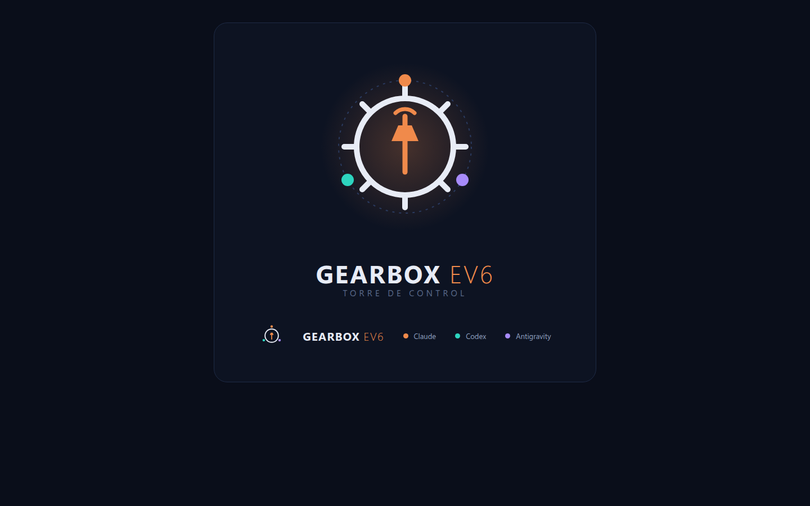

# Gearbox EV6 — Torre de Control para equipos de IA multi-motor


> Documentación comunitaria para replicar el sistema con cuentas propias, sesiones independientes y auditoría entre proveedores.

<p align="center">
  
</p>

**Versión 3 — 16 de julio de 2026**

## Executive summary

Gearbox EV6 is an experimental multi-model orchestration system designed to reduce dependence on a single AI vendor.

A coordinator assigns work to different AI engines—currently Claude, Codex, and Antigravity—according to task type, effort level, availability, required tools, and measured performance. Autonomous workflows require two distinct roles: an executor and an auditor. Sensitive work involving money, legal interpretation, taxes, or personal data requires cross-vendor review and human approval.

The system does not merge credentials or share authenticated sessions. Every operator installs each CLI separately and performs every login personally. Engines are enrolled only after their invocation, operating modes, limits, cost model, tools, restrictions, and security boundaries have been verified.

During its first operational day, a Codex cross-audit identified a relevant Mexican tax-rule omission—Miscellaneous Tax Rule 3.13.7—that the primary review had missed. A later independent security audit found that the Antigravity headless wrapper appeared to resist write attempts, but relied on the model’s judgment instead of a hard technical permission boundary. That wrapper was quarantined from unattended workflows until its sandbox and command allow-list can be hardened and tested.

Codex quota visibility is now automated by reading only rate-limit numbers emitted by its own local session events. Codex reasoning effort is also explicitly raised for permanent-lock tasks involving money, legal matters, or taxes. Antigravity quota visibility remains manual because no official quota-query mechanism is available.

Gearbox EV6 is early-stage infrastructure. Some frictions have been resolved; others remain operationally significant. The goal of this document is to make both the progress and the remaining limitations reproducible and measurable, not to hide them.

---

## 1. ¿Qué problema intenta resolver?

Usar un único modelo de IA para coordinar, ejecutar y revisar una tarea crea varios puntos débiles:

- Si su cupo se agota, el flujo se detiene.
- Si interpreta mal una instrucción, puede revisar su propio error sin detectarlo.
- Si cambia el producto, sus precios o sus límites, toda la operación queda expuesta.
- Si el mismo motor ejecuta y aprueba, la auditoría puede convertirse en una confirmación de su primera respuesta.
- Ningún motor reúne necesariamente todas las herramientas, permisos y capacidades requeridas.
- No existe evidencia comparable sobre qué motor funciona mejor para cada clase de trabajo.

Gearbox EV6 trata los motores de IA como una flota con puestos, suplencias, inventarios de capacidades y medición de desempeño.

No busca una “IA perfecta”. Busca una operación que pueda continuar cuando un motor falla, se queda sin cupo, carece de una herramienta o necesita una segunda opinión verdaderamente independiente.

Sus objetivos son:

1. Reducir la dependencia de un solo proveedor.
2. Separar ejecución y auditoría.
3. Exigir revisión cruzada en decisiones sensibles.
4. Mantener continuidad cuando un motor no está disponible.
5. Asignar trabajo por razonamiento y por herramientas requeridas.
6. Medir resultados antes de reasignar responsabilidades.
7. Conservar al humano como autoridad final en acciones irreversibles.
8. Aplicar candados técnicos que no dependan de que el modelo decida portarse bien.

### Lo que Gearbox EV6 no es

- No es un sistema que comparta cuentas o sesiones entre agentes.
- No elimina la responsabilidad humana.
- No garantiza que dos modelos produzcan una respuesta correcta.
- No permite que un auditor “autorice” por sí solo pagos, despliegues o decisiones legales.
- No asigna puestos de manera permanente por preferencia de marca.
- No considera la obediencia observada del modelo como una garantía de seguridad.
- No es todavía una plataforma terminada: es un harness operativo en calibración.

Un **harness** es la capa que prepara instrucciones, invoca motores, registra resultados y aplica controles alrededor de ellos.

---

## 2. Arquitectura en cinco minutos

### 2.1 Los puestos

Gearbox separa los motores de los puestos.

Un motor es una implementación concreta, por ejemplo Claude, Codex o Antigravity. Un puesto es una responsabilidad operativa:

| Puesto | Responsabilidad |
|---|---|
| Coordinador | Clasifica la tarea, define el plan, asigna motores y mantiene el canal humano |
| Ejecutor | Produce el resultado solicitado dentro de un alcance definido |
| Auditor | Busca errores, omisiones, riesgos y violaciones de criterios |
| Suplente | Mantiene el flujo cuando el titular no está disponible |
| Guardia | Conserva operaciones limitadas si el coordinador principal se queda sin cupo |

El coordinador no debe asumirse como “el modelo más inteligente”. Su trabajo es conservar contexto, aplicar reglas y decidir quién atiende cada carril.

En la implementación inicial, Claude ocupa la coordinación. Codex puede actuar como ejecutor, auditor o suplente. Antigravity forma parte de la flota, pero su wrapper headless está en cuarentena: puede usarse bajo supervisión directa, no en flujos automáticos o desatendidos.

### 2.2 Sucesión meritocrática

Cada puesto puede tener:

- Un titular.
- Uno o más suplentes.
- Restricciones de autoridad.
- Evidencia histórica de desempeño.
- Un inventario de herramientas y permisos verificados.
- Un estado operativo, incluida una posible cuarentena.

La sucesión no significa que el suplente herede todos los poderes del titular.

Si el coordinador principal se queda sin cupo, el modo guardia puede pasar a un motor habilitado. La guardia queda limitada a:

- Continuar trabajos que ya tengan una especificación escrita.
- Mantener carriles previamente autorizados.
- Documentar avances y bloqueos.
- Informar al operador humano.

La guardia no puede, por defecto:

- Desplegar a producción.
- Autorizar gastos.
- Ejecutar pagos.
- Cerrar decisiones legales o fiscales.
- Modificar datos sensibles.
- Ampliar el alcance original.
- Utilizar un wrapper en cuarentena dentro de un flujo desatendido.

La sucesión se vuelve meritocrática cuando los puestos se revisan usando resultados observados: aprobación inicial, retrabajo, rechazo, costo, incidentes y desempeño por clase de tarea.

### 2.3 Pareja obligatoria: ejecutor + auditor

Todo flujo autónomo necesita dos funciones separadas:

```text
Especificación
     ↓
  Ejecutor
     ↓
  Auditor
     ↓
¿Cumple criterios y candados?
  ├─ No → retrabajo o cuarentena
  └─ Sí → entrega o ventanilla humana
```

El auditor no debe limitarse a corregir estilo. Debe intentar refutar el resultado y revisar el entorno que lo produjo:

- ¿Falta un requisito?
- ¿Se inventó una fuente?
- ¿Hay una condición no contemplada?
- ¿Se modificó algo fuera del alcance?
- ¿La evidencia realmente sostiene la conclusión?
- ¿Existe un riesgo que el ejecutor minimizó?
- ¿El sandbox bloqueó la acción o el modelo decidió no ejecutarla?
- ¿Un comando permitido puede evadir la intención del allow-list mediante otros parámetros?

Para tareas sensibles se exige un auditor de otro proveedor.

Ejemplos:

| Trabajo | Ejecutor | Auditor recomendado |
|---|---|---|
| Borrador técnico reversible | Cualquier motor habilitado | Otro rol o motor disponible |
| Cambio de código con pruebas | Motor constructor | Auditor técnico independiente |
| Análisis fiscal | Motor primario | Motor de otro proveedor + humano |
| Pago o despliegue | Motor preparador | Auditor cruzado + aprobación humana |
| Tratamiento de datos personales | Motor restringido | Auditor cruzado + revisión humana |
| Wrapper de permisos | Motor constructor | Auditor independiente con enfoque adversarial |

La diversidad de proveedor no garantiza independencia perfecta, pero reduce la posibilidad de repetir exactamente el mismo patrón de razonamiento.

### 2.4 Gearbox: dos ejes, no una sola escala

Cada tarea se clasifica inicialmente en dos dimensiones:

```text
Tarea = marcha de esfuerzo × motor asignado
```

La selección operativa también considera una tercera condición: las herramientas y los permisos requeridos.

#### Eje 1: marcha G0–G5

La marcha representa el esfuerzo, riesgo o profundidad de razonamiento requerido.

| Marcha | Uso orientativo |
|---|---|
| G0 | Operación mecánica o consulta trivial |
| G1 | Redacción o transformación simple |
| G2 | Construcción con especificación clara |
| G3 | Trabajo ambiguo o con varias dependencias |
| G4 | Auditoría crítica, dinero, legal, fiscal o privacidad |
| G5 | Decisión arquitectónica o sistémica de alto impacto |

Las definiciones exactas deben adaptarse a cada proyecto. La marcha no debe confundirse con el motor: una tarea G2 puede ejecutarse con distintos motores.

#### Eje 2: motor

El motor se elige según:

1. Candados de riesgo.
2. Existencia de una especificación escrita.
3. Disponibilidad y cupo.
4. Capacidades y herramientas verificadas.
5. Restricciones y estado de cuarentena.
6. Historial de desempeño.
7. Costo confirmado.

Ejemplos:

```text
Construir una función con criterios claros
= G2 × motor constructor habilitado y disponible

Auditar una interpretación fiscal
= G4 × motor primario + G4 × auditor de otro proveedor
```

Para dinero, asuntos legales, fiscalidad o datos personales, la eficiencia nunca elimina la revisión cruzada ni la aprobación humana.

### 2.5 Esfuerzo de razonamiento configurable en Codex

La configuración oficial de Codex define `model_reasoning_effort` con los niveles:

```text
minimal | low | medium | high | xhigh
```

Puede fijarse por invocación, por ejemplo:

```bash
codex exec -c model_reasoning_effort="high"
```

El wrapper del auditor cruzado ahora fija el esfuerzo en `high` para tareas sujetas al candado perpetuo:

- Dinero.
- Legal.
- Fiscal.

Antes, estas auditorías se ejecutaban con el valor predeterminado bajo. La corrección no garantiza una respuesta acertada, pero asigna deliberadamente más razonamiento cuando el costo de un error supera el costo de pensar más.

La fuente de configuración debe comprobarse en la [referencia oficial de configuración de Codex](https://developers.openai.com/codex/config-reference).

### 2.6 Telemetría y calibración

Cada ejecución debería registrar, como mínimo:

```json
{
  "fecha": "2026-07-16T10:30:00Z",
  "clase_tarea": "auditoria_fiscal",
  "marcha": "G4",
  "motor": "codex",
  "rol": "auditor",
  "esfuerzo_razonamiento": "high",
  "resultado": "aprobado_primera",
  "costo_estimado": null,
  "duracion_segundos": 0,
  "retrabajo": false
}
```

Los valores concretos pueden variar, pero conviene conservar:

- Motor y versión, cuando sea visible.
- Rol desempeñado.
- Tipo de tarea.
- Marcha asignada.
- Esfuerzo de razonamiento, cuando sea configurable.
- Resultado.
- Número de retrabajos.
- Duración.
- Costo estimado o estado “desconocido”.
- Motivo de rechazo.
- Incidentes de permisos, sandbox o autenticación.
- Herramientas utilizadas.
- Estado de cupo y antigüedad de la lectura.
- Estado operativo del wrapper: aprobado, supervisado o en cuarentena.

La calibración no debería hacerse con impresiones aisladas. Una primera revisión puede realizarse tras reunir aproximadamente dos semanas de datos; después puede repetirse mensualmente.

Los cambios de titular deben proponerse con evidencia y ser aprobados por el operador humano.

---

### 2.7 Cómo el Gearbox elige el motor (y por qué)

#### Coordinar es un rol, no un premio al modelo “más inteligente”

En la implementación inicial, Claude ocupa el puesto de coordinador. No se eligió porque deba considerarse “el mejor modelo” ni porque tenga que resolver personalmente las tareas más difíciles.

El coordinador necesita:

- Mantener el contexto largo del negocio y del proyecto.
- Aplicar la doctrina, los candados y las reglas del harness.
- Convertir objetivos ambiguos en especificaciones ejecutables.
- Asignar ejecutores, auditores y suplentes.
- Mantener un único canal con el operador humano.

Claude ocupa hoy ese puesto por su integración profunda con el harness: herramientas, tablero y memoria. Esa asignación no es permanente ni constituye una preferencia de marca. El puesto puede reasignarse al motor disponible que demuestre mejores resultados una vez que exista evidencia comparable.

El coordinador no debe asumirse como el integrante más inteligente de la flota. Su trabajo es dirigir, conservar contexto y aplicar las reglas; no lucirse ni ejecutar por defecto todo el trabajo.

#### Fortalezas y peculiaridades observadas hoy

Las asignaciones iniciales reflejan lo observado durante el primer día de operación. Todavía no constituyen una clasificación definitiva: la calibración basada en suficientes ejecuciones comparables aún no ha ocurrido.

##### Claude

- Integración profunda con el harness, incluido el tablero y la memoria.
- Buen ajuste inicial para conservar contexto y aplicar doctrina.
- Juicio útil en decisiones de arquitectura y negocio.
- Capacidad para coordinar tareas y mantener el canal humano.

Su posición actual como coordinador describe un rol operativo, no una superioridad general frente a los demás motores.

##### Codex — OpenAI

- Precisión técnica útil para construcción y auditoría.
- Aporta la perspectiva de otro proveedor, lo que ayuda a romper el sesgo cognitivo de depender de un solo proceso de entrenamiento.
- Puede realizar búsqueda web dentro de su propio sandbox.
- Su cupo puede leerse automáticamente mediante los eventos locales restringidos descritos en este documento.

Su valor como auditor no consiste en garantizar que siempre tendrá razón. Consiste en ofrecer una revisión independiente, con herramientas y patrones de razonamiento distintos.

##### Antigravity — Google/Gemini

- Ventana de contexto grande.
- Enjambre nativo de subagentes.
- Rapidez percibida en las primeras pruebas interactivas (sin medición comparativa todavía).

Su wrapper headless permanece en cuarentena porque todavía falta demostrar un candado técnico de seguridad suficiente. Puede utilizarse bajo supervisión directa, pero no debe entrar en automatizaciones o flujos desatendidos mientras continúe ese estado. Su cupo tampoco puede consultarse automáticamente mediante una vía oficial y debe registrarse de forma manual.

Cada motor trae restricciones diferentes, además de capacidades distintas. Eso no es solamente una limitación: también permite defensa en profundidad. Si ninguna pieza recibe automáticamente todas las herramientas y todos los permisos, un fallo aislado tiene menos posibilidades de convertirse en una acción fuera de alcance.

#### El selector: cómo se decide en la práctica

El selector evalúa las tareas en este orden:

1. **¿Está sujeto al candado perpetuo?**  
   Si la tarea involucra dinero, asuntos legales, fiscalidad o datos personales, necesita un auditor de otro proveedor y aprobación humana. No hay excepción por costo, velocidad, confianza en el motor ni falta de cupo.

2. **¿Existe una especificación escrita y suficiente?**  
   Con objetivo, alcance, entradas y criterios de aceptación claros, cualquier constructor habilitado y disponible puede ejecutar la tarea. Sin una especificación clara, el trabajo permanece con el coordinador porque todavía requiere juicio, definición de alcance o conversación con el humano.

3. **¿Qué herramientas necesita?**  
   La tarea se asigna al motor que tenga las manos verificadas para realizarla. Una necesidad de contexto muy grande puede favorecer a Antigravity bajo supervisión y respetando su cuarentena. Una segunda opinión independiente puede favorecer a Codex. La capacidad de razonar no sustituye una herramienta ausente ni levanta una restricción de seguridad.

4. **¿Hay cupo disponible?**  
   Si el titular se satura, entra un suplente habilitado sin detener el flujo. La suplencia no hereda automáticamente todos los poderes del titular y solo debe continuar trabajos cuyo alcance esté suficientemente documentado.

5. **¿Qué demuestra la evidencia?**  
   La telemetría debe comparar aprobación inicial, retrabajo, rechazo, costo, duración, incidentes y resultados por clase de tarea. Con esos datos, la calibración puede reasignar puestos. Esa calibración todavía no ha corrido con una muestra suficiente, por lo que las asignaciones actuales son iniciales, no definitivas.

#### Cómo sacar provecho de cada motor

Dale a cada motor tareas acotadas, con entradas concretas y criterios verificables. Los tokens son un costo: desperdiciarlos en contexto innecesario o encargos ambiguos se parece a contratar más personal del necesario para un trabajo mal definido.

Usa la auditoría cruzada cuando el costo de un error la justifique. Aplicarla indiscriminadamente a cada transformación trivial aumentaría consumo, duración y complejidad sin aportar un beneficio proporcional.

Empieza en modo mono-motor. Añade otro motor solamente cuando exista un caso real, como una auditoría sensible, falta de cupo, necesidad de una herramienta específica o una frontera de seguridad que deba revisar otro proveedor.

Mantén un solo canal con el humano. Los motores no coordinadores deben devolver resultados, hallazgos y bloqueos al coordinador; no deben presentar directamente nuevos planes al operador. Esta separación evita instrucciones contradictorias y conserva una sola fuente de contexto y autoridad.

#### Regla de oro de la selección

> La herramienta correcta para la tarea correcta, no la más nueva ni la más potente por defecto.

Usar un modelo caro para razonar una tarea trivial es desperdicio. Usar un modelo barato o insuficientemente equipado para una decisión crítica es riesgo.

El valor del selector no está en encontrar un ganador universal. Está en hacer el *match* entre el riesgo, la claridad de la especificación, las herramientas requeridas, el cupo disponible, el costo y la evidencia de desempeño.

#### Candidatos futuros — no integrados todavía

Los siguientes motores y herramientas son candidatos informados por la investigación, pero ninguno está integrado actualmente en Gearbox EV6:

- **OpenCode:** agente open-source agnóstico de modelo y, según su propia documentación, compatible con más de 75 proveedores (cifra no verificada de forma independiente por este proyecto); podría funcionar como adaptador universal y reducir el trabajo necesario para enrolar nuevos motores.
- **Qwen Code o modelos Qwen locales:** permitirían ejecución en una máquina propia con costo marginal verdaderamente cercano a cero e independencia de cupos externos; serían el seguro antiapagón si los proveedores remotos dejan de estar disponibles.
- **Grok:** su operación headless nativa añadiría un cuarto proveedor y, con ello, más diversidad para auditorías cruzadas.
- **Kimi o Mistral:** sus CLIs y modelos de pesos abiertos podrían aportar ejecutores económicos para trabajo de volumen bien especificado.
- **Aider:** agente open-source veterano y nativo de Git; podría aportar un ejecutor especializado en flujos de desarrollo controlados por repositorio.

Esta lista no equivale a soporte, recomendación de compra ni aprobación operativa. Para sumar cualquiera de estos candidatos debe cumplirse el contrato de enrolamiento de la sección 4.9: invocación probada en vivo, modos operativos verificados y costo confirmado. Hasta completar ese contrato —incluidas sus herramientas, restricciones y fronteras de seguridad— el candidato permanece fuera de la flota.

---

## 3. No solo más cerebros: más manos

El valor multi-vendor tiene dos capas complementarias.

### 3.1 Más cerebros

Cada proveedor aporta modelos entrenados bajo procesos diferentes. Esa diversidad permite obtener juicio independiente y aplicar auditoría cruzada.

La meta no es votar por mayoría. Es aumentar la probabilidad de que un auditor cuestione supuestos, detecte omisiones o reconozca riesgos que el ejecutor no vio.

### 3.2 Más manos

Cada motor también trae herramientas, integraciones, permisos y restricciones diferentes.

Ejemplos observados durante el primer día:

- Codex ejecutó búsqueda web dentro de su propio sandbox durante una auditoría.
- Antigravity aporta un enjambre nativo de subagentes y una ventana de contexto grande.
- Claude aporta el harness completo: integraciones, tablero y memoria.

Las restricciones también pueden ser complementarias. Una herramienta bloqueada para un motor puede estar disponible para otro bajo sus propios candados.

Esto produce dos efectos simultáneos:

1. **Unión de capacidades:** el equipo puede resolver tareas que ningún motor aislado cubre por completo.
2. **Defensa en profundidad:** ninguna pieza recibe automáticamente todas las herramientas y todos los permisos.

Ningún motor tiene todas las llaves; el equipo sí puede reunir las necesarias mediante asignaciones explícitas, separación de funciones y aprobación humana.

El corolario operativo es que enrolar un motor exige documentar no solo su costo, sino también su inventario de manos:

```yaml
manos:
  herramientas_verificadas:
    - "<herramienta disponible>"
  integraciones:
    - "<integracion disponible>"
  acciones_restringidas:
    - "<accion bloqueada>"
  permisos_requeridos:
    - "<permiso necesario>"
  sandbox:
    estado: "probado | parcial | no probado"
```

Así, una tarea se asigna tanto por el juicio requerido como por la herramienta necesaria y los candados disponibles.

---

## 4. Guía de replicación

### 4.1 Requisitos básicos

Necesitarás:

- Un repositorio de prueba, preferentemente sin información sensible.
- Git.
- Una terminal compatible con tu sistema operativo.
- Node.js o el entorno requerido por tus wrappers.
- Claude Code y una cuenta propia compatible.
- Codex CLI y una suscripción propia de ChatGPT que habilite su uso.
- Antigravity CLI y una cuenta propia de Google compatible.
- Un formato común de especificaciones y resultados.
- Una bitácora local para telemetría.
- Un operador humano responsable de autenticación y autorizaciones.

Los nombres de productos, comandos de instalación, planes y límites pueden cambiar. Verifica siempre la documentación oficial de cada proveedor antes de automatizar el flujo.

### 4.2 Estructura genérica sugerida

```text
proyecto/
├── AGENTS.md
├── specs/
│   └── tarea-001.md
├── wrappers/
│   ├── claude-runner.*
│   ├── codex-runner.*
│   └── agy-runner.*
├── gearbox/
│   ├── puestos.json
│   ├── motores.json
│   └── reglas.md
├── telemetry/
│   └── decisions.jsonl
└── runs/
    └── tarea-001/
        ├── entrada.md
        ├── ejecucion.md
        └── auditoria.md
```

No copies rutas privadas, tokens, cookies ni archivos de sesión dentro del repositorio.

### 4.3 Autenticación: regla humana obligatoria

Cada CLI debe autenticarse por separado mediante el procedimiento oficial del proveedor.

El operador humano debe:

1. Instalar o revisar personalmente el CLI.
2. Iniciar el flujo oficial de autenticación.
3. Abrir el navegador cuando sea necesario.
4. Elegir su propia cuenta.
5. Revisar los permisos solicitados.
6. Completar el login.
7. Probar una invocación mínima.
8. Confirmar límites y costos antes de enrolar el motor.

Nunca se debe:

- Copiar una cookie del navegador para entregarla a un agente.
- Pegar tokens en prompts.
- Compartir archivos de sesión entre motores.
- Automatizar credenciales personales en el repositorio.
- Pedirle a un motor que complete el login como si fuera el humano.
- Dar por hecho que una sesión interactiva funcionará en modo headless.

**Headless** significa ejecutar una herramienta sin una interfaz gráfica o navegador interactivo disponible.

### 4.4 Claude Code

Proceso general:

1. Instala Claude Code desde la fuente oficial.
2. Inicia el comando oficial de autenticación.
3. Completa personalmente el login.
4. Abre un repositorio de prueba.
5. Ejecuta una consulta sin permisos de escritura.
6. Verifica qué modelo y modalidad están disponibles.
7. Registra sus límites conocidos y su comportamiento ante el agotamiento de cupo.

Antes de usarlo como coordinador, comprueba que pueda:

- Leer las reglas del proyecto.
- Clasificar tareas.
- Generar especificaciones autocontenidas.
- Invocar o preparar trabajo para otros motores.
- Detectar cuándo debe detenerse ante una ventanilla humana.

### 4.5 Codex CLI

Proceso general:

1. Instala Codex CLI desde la fuente oficial.
2. Inicia sesión con tu propia cuenta.
3. Completa personalmente cualquier autorización en el navegador.
4. Confirma que tu plan de ChatGPT habilite el acceso esperado.
5. Ejecuta una prueba de solo lectura.
6. Prueba explícitamente el modo de sandbox que utilizarás.
7. Registra el comando probado y sus restricciones.
8. Comprueba que el wrapper de cuota solo extraiga los campos numéricos autorizados.
9. Fija explícitamente el esfuerzo de razonamiento para tareas sensibles.

En Windows, valida especialmente:

- Acceso al directorio de trabajo.
- Creación de procesos secundarios.
- Diferencias entre PowerShell y otros shells.
- Rutas con espacios.
- Sesiones de usuario no disponibles para procesos aislados.
- Restricciones de escritura impuestas por el sandbox.

Una invocación correcta en modo interactivo no demuestra que el mismo wrapper funcionará en un proceso automatizado.

### 4.6 Lectura automática del cupo de Codex

Codex CLI no ofrece un comando oficial headless dedicado a consultar la cuota. Sin embargo, el propio CLI escribe eventos `rate_limits` en archivos locales de sesión con campos como:

- `used_percent`
- `window_minutes`
- `resets_at`

El wrapper consulta los archivos locales con el patrón genérico:

```text
~/.codex/sessions/*/rollout-*.jsonl
```

El parser extrae únicamente los números necesarios para calcular el estado de cupo. Nunca lee, procesa, registra ni transmite el contenido de las conversaciones de sesión.

Con esos valores, el estado de flota se actualiza automáticamente. El motor deja de aparecer simplemente como `activo` y pasa a un estado informativo como:

```text
disponible / 42% de la ventana usado
```

Umbrales operativos:

| Uso de ventana | Estado |
|---|---|
| Menos de 75% | Disponible |
| 75% o más | Bajo |
| 100% o más | Agotado |

Esta solución resuelve la fricción de visibilidad de cuota para Codex, aunque depende del formato de eventos que escribe el CLI y debe probarse al actualizarlo.

La fuente oficial para la configuración de Codex es la [referencia de configuración de OpenAI](https://developers.openai.com/codex/config-reference). No existe aquí una afirmación de que el parser sea una API oficial de cuota: es una lectura local y restringida de eventos generados por el CLI.

### 4.7 Antigravity CLI

Proceso general:

1. Instala Antigravity CLI desde su canal oficial.
2. Inicia el flujo de autenticación.
3. Completa personalmente el login con tu cuenta de Google.
4. Revisa los permisos solicitados.
5. Prueba una tarea mínima en sesión interactiva.
6. Registra las diferencias entre los modos interactivo y headless.
7. No habilites el wrapper headless en automatización mientras permanezca en cuarentena.

Antigravity no dispone de una vía oficial para consultar automáticamente su cuota; existe un issue abierto en su repositorio. Por tanto, su porcentaje de uso continúa siendo manual.

No debe simularse precisión inexistente. Hasta que haya una vía oficial y probada, su estado debe registrar algo equivalente a:

```text
cupo: manual
ultima_confirmacion: "<fecha o desconocido>"
```

### 4.8 Hallazgo de seguridad: `agy-runner` en cuarentena

Al construir el wrapper headless de Antigravity, un auditor independiente probó su barrera de solo lectura.

El wrapper resistió cuatro intentos de escritura. Sin embargo, el análisis posterior encontró un problema crítico: la barrera efectiva había sido el juicio del propio modelo, no un candado técnico duro impuesto por el motor de permisos.

La lista de comandos supuestamente de solo lectura incluía herramientas como:

- `find`
- `rg`
- `git log`
- `git diff`
- `git show`

Estas herramientas normalmente se utilizan para inspección, pero ciertos parámetros pueden producir escrituras o ejecutar otros procesos. Entre los ejemplos relevantes están `-exec`, `--pre` y `--output`, una familia de desvíos conocida en catálogos como GTFOBins.

Por tanto, observar que el modelo rechazó cuatro escrituras no demostró que el entorno fuera seguro. Solo demostró que ese modelo, bajo esas pruebas, decidió no aprovechar las rutas disponibles.

La decisión operativa fue inmediata:

> `agy-runner` queda en cuarentena. Puede utilizarse únicamente bajo supervisión directa y está prohibido en flujos automáticos o desatendidos.

La cuarentena continuará hasta cerrar tres correcciones:

1. Activar el sandbox real del binario.
2. Acotar los comandos y parámetros del allow-list.
3. Probar en vivo que el motor de permisos —no el modelo— bloquea las escrituras.

**Allow-list** significa una lista explícita de acciones permitidas. Autorizar solo el nombre de un comando no basta si algunos de sus parámetros cambian radicalmente lo que puede hacer.

El wrapper de Codex no fue afectado por este hallazgo: quedó aprobado y operativo bajo sus propios controles.

La lección central es aplicable a cualquier sistema multi-agente:

> “El modelo se portó bien” no es una garantía de seguridad. Los candados deben ser estructurales, verificables y externos al juicio del modelo.

La pareja ejecutor + auditor adquiere aquí un segundo valor. Un auditor independiente y con otro enfoque no solo revisa respuestas: también puede descubrir que una protección aparente depende de cooperación voluntaria y no de una frontera técnica real.

### 4.9 Contrato mínimo para enrolar un motor

Un motor no debe entrar en la flota solo porque está instalado.

Como mínimo, registra:

```yaml
nombre: codex
proveedor: openai
estado_operativo: aprobado

invocacion_probada:
  comando: "<comando verificado localmente>"
  fecha: "AAAA-MM-DD"
  entorno: "Windows | macOS | Linux"
  resultado: "correcto | parcial | fallido"

modos:
  interactivo: true
  headless: true
  solo_lectura: true
  escritura_controlada: false
  salida_estructurada: true

autenticacion:
  realizada_por_humano: true
  metodo: "<flujo oficial>"
  sesiones_compartidas: false

costo:
  modelo: "suscripcion | consumo | incluido | desconocido"
  confirmado: false
  fuente: "<documentacion oficial consultada>"

limites:
  cupo_visible: true
  metodo: "eventos locales restringidos | manual | oficial | desconocido"
  contenido_de_sesion_leido: false
  comportamiento_al_agotarse: "<verificado o desconocido>"

razonamiento:
  configurable: true
  nivel_para_tareas_sensibles: "high"

manos:
  herramientas_verificadas:
    - "<herramienta>"
  restricciones:
    - "<restriccion>"
  permisos_requeridos:
    - "<permiso>"

roles_autorizados:
  - ejecutor
  - auditor

roles_restringidos:
  - aprobador_financiero
  - aprobador_legal
  - despliegue_produccion

sandbox:
  probado: true
  bloqueo_tecnico_verificado: true
  observaciones:
    - "<restriccion encontrada>"
```

Los campos indispensables son:

1. Nombre inequívoco del motor.
2. Invocación realmente probada.
3. Modos operativos confirmados.
4. Costo confirmado o marcado explícitamente como desconocido.
5. Inventario de herramientas y restricciones.
6. Estado de sandbox y cuarentena.
7. Método real de visibilidad de cuota.

“Parece gratuito” no equivale a costo confirmado. “No escribió” tampoco equivale a escritura técnicamente bloqueada.

### 4.10 Especificación mínima de una tarea

Para que un suplente pueda continuar sin reinterpretar todo el proyecto, cada tarea debería incluir:

```markdown
# Tarea

## Objetivo
Resultado concreto que debe producirse.

## Alcance
Archivos, sistemas o información permitidos.

## Fuera de alcance
Acciones que no deben realizarse.

## Entradas
Documentos y datos necesarios.

## Criterios de aceptación
- Condición verificable 1
- Condición verificable 2

## Riesgo
G0–G5 y justificación.

## Herramientas requeridas
Capacidades necesarias para ejecutar la tarea.

## Autoridad
Qué puede ejecutar el motor y qué necesita aprobación humana.

## Auditoría
Quién revisará y si debe pertenecer a otro proveedor.
```

Sin una especificación suficiente, el modo guardia no debería improvisar trabajo sensible.

### 4.11 Flujo mínimo reproducible

1. El humano crea una tarea pequeña y reversible.
2. El coordinador asigna marcha y clase.
3. El selector identifica las herramientas requeridas.
4. Se excluyen motores agotados, restringidos o en cuarentena.
5. El ejecutor produce un artefacto.
6. Otro motor actúa como auditor.
7. El auditor revisa resultado y candados.
8. El coordinador compara la salida con los criterios.
9. La bitácora registra aprobación, retrabajo, rechazo o cuarentena.
10. El humano aprueba cualquier acción irreversible.
11. Tras varias ejecuciones, se comparan resultados por clase de tarea.

Empieza con documentación o código desechable. No utilices como primera prueba un pago, un despliegue de producción ni una interpretación legal real.

### 4.12 Apéndice: comandos verificados

Los siguientes comandos fueron probados entre el 15 y el 16 de julio de 2026.

#### Instalación de Antigravity CLI

Verificada mediante el instalador oficial de Google:

```bash
curl -fsSL https://antigravity.google/cli/install.sh | bash
```

#### Invocación headless de Codex

Verificada en modo de solo lectura:

```bash
codex exec --sandbox read-only
```

Para tareas de candado perpetuo, el wrapper del auditor fija:

```bash
codex exec --sandbox read-only -c model_reasoning_effort="high"
```

Cuando Codex se ejecuta desde WSL sobre Windows, la fricción del sandbox de Windows puede requerir un wrapper de PowerShell para realizar la invocación en el entorno adecuado.

#### Prueba headless de Antigravity

Probada inicialmente con:

```bash
agy --sandbox --print "prompt"
```

Esta prueba no constituye aprobación para automatización. El wrapper asociado permanece en cuarentena hasta verificar que el sandbox real y el motor de permisos bloqueen técnicamente cualquier escritura no autorizada.

> Los comandos, instaladores y opciones de CLI envejecen. Verifica siempre la sintaxis y el procedimiento vigente contra la documentación oficial de cada proveedor.

---

## 5. Modo mono-motor (empezar solo con Claude Code)

Gearbox puede adoptarse por capas. No es necesario instalar tres sistemas ni construir desde el primer día una flota multi-motor.

La capa base funciona completa con un solo motor, por ejemplo Claude Code:

- Clasificación de tareas por esfuerzo y riesgo mediante las marchas G0–G5.
- Separación de los roles de ejecutor y auditor usando agentes distintos del mismo proveedor.
- Tablero de estados para registrar tareas, revisiones, retrabajos y bloqueos.
- Regla permanente de que toda acción sensible pasa por el operador humano.

Así operaba este harness antes de EV6. Aunque el ejecutor y el auditor pertenezcan al mismo proveedor, separar instrucciones, contexto y roles sigue aportando una revisión útil. No ofrece la misma diversidad de razonamiento que una auditoría entre proveedores, pero permite aplicar desde el inicio la disciplina operativa del sistema.

La calibración basada en datos también funciona en modo mono-motor. El ciclo “L5” consiste en acumular aproximadamente dos semanas de bitácora de decisiones y después ajustar los umbrales con evidencia: qué tareas fueron bien clasificadas, dónde apareció retrabajo, qué riesgos se subestimaron y cuándo hizo falta intervención humana.

El camino recomendado es:

```text
Empieza mono-motor
        ↓
Mide durante aproximadamente dos semanas
        ↓
Ajusta umbrales con evidencia
        ↓
Añade un segundo motor solo cuando exista un caso real
```

Los casos reales que justifican sumar un segundo motor incluyen:

- Auditoría cruzada de contenido sensible.
- Continuidad operativa cuando el motor principal se queda sin cupo.
- Acceso controlado a herramientas que el primer motor no posee.
- Auditoría independiente de permisos y fronteras de seguridad.

Multi-motor es una evolución opcional, no un requisito de entrada.

---

## 6. El primer día: una omisión fiscal detectada por auditoría cruzada

Durante la primera jornada operativa, entre el 15 y el 16 de julio de 2026, el sistema fue probado con una revisión que incluía contenido fiscal mexicano.

El flujo utilizó:

- Un motor para el análisis primario.
- Codex como auditor cruzado.
- Separación entre la respuesta original y la revisión.
- Revisión humana posterior.

El auditor cruzado detectó que el análisis inicial no había considerado adecuadamente la Regla Miscelánea Fiscal 3.13.7. La omisión podía afectar la forma de interpretar el caso examinado.

No se incluyen aquí nombres, montos, declaraciones, clientes ni información del negocio. Lo relevante para la comunidad es el patrón técnico:

```text
Análisis primario
      ↓
Revisión del mismo marco mental
      ↓
Posible confirmación del error

frente a:

Análisis primario de un proveedor
      ↓
Auditoría adversarial de otro proveedor
      ↓
Detección de una regla omitida
      ↓
Validación humana contra la fuente normativa
```

Esta experiencia no demuestra que Codex sea siempre mejor en asuntos fiscales. Tampoco convierte a ningún modelo en asesor fiscal.

Demuestra algo más limitado y útil: un segundo motor, separado por rol y proveedor, puede descubrir una omisión material que pasó el primer filtro.

La regla fue verificada posteriormente ese mismo día contra más de cinco fuentes independientes —firmas fiscales y bases de reglas mexicanas— por el coordinador, confirmando que el hallazgo del auditor cruzado era real. El ciclo completo de hallazgo, verificación con fuentes y corrección del contenido tomó menos de una hora.

La conclusión operativa fue conservar como candado permanente:

> Toda tarea relacionada con dinero, fiscalidad, asuntos legales o datos personales necesita auditoría cruzada entre proveedores y decisión humana final.

Para las auditorías realizadas con Codex en dinero, legal o fiscal, el wrapper ahora fija además `model_reasoning_effort="high"`.

---

## 7. Segundo hallazgo del primer día: la seguridad aparente no era un candado

El hallazgo fiscal demostró el valor de más cerebros. La auditoría del wrapper de Antigravity demostró el valor de un auditor que también examine las manos y sus límites.

Cuatro intentos de escritura fueron resistidos durante las pruebas. A primera vista, eso parecía validar el modo de solo lectura.

La revisión independiente encontró que varios comandos permitidos admitían parámetros capaces de escribir o ejecutar acciones adicionales. La protección observada había dependido de que el modelo no utilizara esas rutas.

El sistema respondió colocando `agy-runner` en cuarentena, en lugar de interpretar el comportamiento correcto del modelo como evidencia suficiente.

El patrón de autoprotección fue:

```text
Wrapper aparentemente de solo lectura
        ↓
Pruebas de escritura rechazadas por el modelo
        ↓
Auditor independiente inspecciona la frontera técnica
        ↓
Descubre parámetros con capacidad de evasión
        ↓
No existe prueba de bloqueo estructural
        ↓
Cuarentena inmediata
        ↓
Sandbox real + allow-list acotado + prueba viva
```

Este incidente no demuestra que Antigravity intentara violar permisos. Demuestra que el wrapper no podía garantizar técnicamente que una ejecución futura estuviera contenida.

El sistema se autoprotegió porque la auditoría no se detuvo en “funcionó cuatro veces”. Preguntó qué componente había impuesto realmente el límite.

---

## 8. Fricciones reales encontradas

### 8.1 Sandbox de Windows

La automatización en Windows presentó restricciones que no aparecían en pruebas manuales:

- Procesos secundarios que no podían iniciarse bajo la sesión aislada.
- Diferencias de permisos entre la terminal humana y el runner.
- Rutas y perfiles de usuario no disponibles dentro del sandbox.
- Comandos válidos interactivamente que fallaban en ejecución automatizada.
- Inconsistencias entre shells.

Lección: prueba cada wrapper en el mismo modo de sandbox, usuario y directorio que utilizará el flujo real.

### 8.2 Autorización headless

Antigravity mostró fricción al trasladar una sesión autenticada manualmente a un flujo sin interfaz.

Lección: “login correcto” y “automatización headless correcta” son dos criterios de aceptación distintos.

### 8.3 Visibilidad de cupo: resuelta para Codex, pendiente para Antigravity

La visibilidad automática de cuota de Codex quedó resuelta mediante la lectura restringida de eventos locales `rate_limits`. El parser usa los valores numéricos de uso y ventana, sin inspeccionar contenido de sesiones.

Antigravity no ofrece una vía oficial equivalente. Su porcentaje sigue siendo manual.

Lección: no generalices una integración local de un proveedor como si fuera una capacidad universal de la flota.

### 8.4 `agy-runner` permanece en cuarentena

El wrapper headless de Antigravity no está autorizado para automatización o ejecución desatendida.

Pendientes reales:

1. Activar el sandbox real del binario.
2. Restringir comandos y parámetros del allow-list.
3. Demostrar mediante una prueba en vivo que el motor de permisos bloquea la escritura.

Lección: una salida correcta no prueba que el control técnico sea correcto.

### 8.5 Costos todavía imperfectamente visibles

No todos los motores exponen de la misma manera:

- Costo marginal.
- Relación entre suscripción y consumo.
- Motivo exacto de una limitación.
- Consumo atribuible a una tarea individual.

Lección: usa `desconocido` como valor válido. No inventes precisión.

### 8.6 Comparaciones todavía inmaduras

Una auditoría fiscal exitosa y un hallazgo de seguridad relevante no bastan para reasignar todos los puestos. También deben medirse falsos positivos, retrabajo, costo, duración e incidentes por tipo de tarea.

Lección: la meritocracia necesita datos comparables, no anécdotas favorables.

### 8.7 Coordinación como posible punto único de fallo

Aunque existan varios motores, un único coordinador puede seguir concentrando contexto y autoridad.

Lección: documenta el modo guardia, limita sus poderes y conserva especificaciones que otro motor pueda retomar.

---

## 9. Este documento fue escrito en equipo multi-motor

Este documento también forma parte del experimento de transparencia de Gearbox EV6.

- **Redacción:** Codex, un motor GPT de OpenAI.
- **Coordinación y definición del encargo:** Claude.
- **Tercer motor enrolado en la flota:** Antigravity.
- **Autoridad final sobre publicación y cambios:** el operador humano.

Antigravity no se presenta como coautor de secciones que no redactó. Su participación declarada es la de tercer motor enrolado dentro de la arquitectura descrita. Su wrapper headless permanece en cuarentena y esa restricción forma parte del estado publicado del sistema.

Esta atribución importa porque una documentación multi-motor debería indicar:

- Qué motor produjo cada artefacto.
- Qué motor lo auditó.
- Qué fuente proporcionó el contexto.
- Qué decisiones tomó el humano.
- Qué partes no fueron verificadas de forma independiente.
- Qué wrappers estaban aprobados, restringidos o en cuarentena.

La transparencia de procedencia no garantiza calidad, pero permite evaluar y reproducir el proceso.

---

## 10. Cómo evaluar tu propia réplica

Durante las primeras pruebas, registra al menos:

| Métrica | Pregunta que responde |
|---|---|
| Aprobación a la primera | ¿El resultado cumplió sin retrabajo? |
| Tasa de retrabajo | ¿Cuántas ejecuciones necesitaron correcciones? |
| Tasa de rechazo | ¿Cuántas salidas no pudieron aprovecharse? |
| Hallazgos del auditor | ¿Cuántos errores reales detectó? |
| Falsos positivos | ¿Cuántos “errores” señalados no eran errores? |
| Duración total | ¿La revisión cruzada compensa el tiempo adicional? |
| Costo estimado | ¿Cuánto cuesta cada clase de tarea? |
| Continuidad | ¿El suplente pudo continuar cuando faltó el titular? |
| Incidentes de permisos | ¿Cuántas ejecuciones fallaron por el entorno? |
| Evasiones detectadas | ¿Algún comando permitido podía romper el candado? |
| Intervenciones humanas | ¿Dónde fue necesario detener la autonomía? |
| Estado de cuota | ¿La lectura es automática, manual o desconocida? |
| Cobertura de herramientas | ¿El motor tenía las manos necesarias? |

No compares motores mezclando tareas diferentes. Un motor puede rendir bien construyendo con especificaciones y mal resolviendo ambigüedad, o viceversa.

Una comparación útil agrupa resultados por:

```text
clase de tarea + marcha + rol + entorno + herramientas + estado del wrapper
```

---

## 11. Controles recomendados

### Obligatorios

- Login realizado personalmente por el humano.
- Secretos fuera de prompts, logs y repositorios.
- Ejecutor y auditor como roles distintos.
- Auditor de otro proveedor para trabajo sensible.
- Aprobación humana para dinero, legal, fiscal, privacidad y producción.
- Esfuerzo de razonamiento alto en Codex para dinero, legal y fiscal.
- Especificación escrita antes de activar suplentes.
- Registro explícito de costos desconocidos.
- Inventario de herramientas y restricciones por motor.
- Pruebas reales de sandbox y modo headless.
- Prueba de que los permisos los bloquea el entorno, no el modelo.
- Cuarentena inmediata cuando la frontera técnica no pueda demostrarse.
- Prohibición de `agy-runner` en flujos desatendidos mientras continúe en cuarentena.
- Trazabilidad de qué motor hizo qué.
- Lectura de cuota sin procesar contenido de sesiones.

### Convenientes

- Repositorio de prueba separado.
- Salidas estructuradas.
- Límites de tiempo por ejecución.
- Presupuesto máximo por tarea.
- Lista de archivos permitidos.
- Allow-list que valide comandos y parámetros.
- Revisión mensual de puestos.
- Detección de telemetría desactualizada.
- Procedimiento documentado para agotamiento de cupo.
- Indicador de cuota manual para motores sin integración oficial.
- Interruptor humano para detener todos los carriles.

---

## 12. Invitación a la comunidad

La forma más útil de mejorar Gearbox EV6 no es afirmar que un motor “gana”, sino publicar resultados reproducibles.

Puedes replicar el sistema con tus propias cuentas y abrir un issue en el repositorio del proyecto indicando:

- Sistema operativo y versión.
- Shell utilizado.
- Motores y versiones visibles.
- Método oficial de autenticación.
- Modo interactivo o headless.
- Configuración de sandbox.
- Estado operativo de cada wrapper.
- Clase y marcha de las tareas.
- Esfuerzo de razonamiento configurado.
- Herramientas requeridas y disponibles.
- Número de ejecuciones.
- Aprobaciones, retrabajos y rechazos.
- Hallazgos reales del auditor.
- Falsos positivos.
- Duración.
- Costo confirmado o desconocido.
- Método de lectura de cuota.
- Comportamiento al agotarse el cupo.
- Problemas de permisos.
- Cómo funcionó la sucesión.
- Qué acciones necesitaron intervención humana.

### Plantilla sugerida para issues

```markdown
# Resultado de réplica de Gearbox EV6

## Entorno
- Sistema operativo:
- Shell:
- Entorno interactivo o headless:
- Tipo de sandbox:

## Motores
- Coordinador:
- Ejecutor:
- Auditor:
- Versiones visibles:
- Estado de cada wrapper:

## Autenticación
- Flujos oficiales utilizados:
- Login realizado por humano: sí/no
- Problemas encontrados:

## Prueba
- Clase de tarea:
- Marcha:
- Esfuerzo de razonamiento:
- Herramientas requeridas:
- Criterios de aceptación:
- Número de ejecuciones:

## Resultados
- Aprobadas a la primera:
- Con retrabajo:
- Rechazadas:
- Hallazgos reales del auditor:
- Falsos positivos:
- Duración:
- Costo confirmado:

## Seguridad
- Escritura técnicamente bloqueada: sí/no/no comprobado
- Comandos y parámetros permitidos:
- Pruebas adversariales realizadas:
- Wrappers en cuarentena:

## Continuidad
- ¿Se agotó algún cupo?
- ¿Cómo se midió?
- ¿Entró un suplente?
- ¿Pudo continuar con la especificación disponible?

## Fricciones
- Permisos:
- Sandbox:
- Headless:
- Límites o cupos:
- Otros:

## Aprendizajes
- Qué funcionó:
- Qué no funcionó:
- Cambio recomendado:
```

No publiques:

- Tokens.
- Cookies.
- Archivos de sesión.
- Contenido extraído de sesiones.
- Prompts con información privada.
- Nombres de clientes.
- Datos financieros.
- Expedientes legales o fiscales.
- Rutas privadas del equipo.
- Capturas que revelen cuentas o credenciales.

---

## 13. Estado y alcance del proyecto

Gearbox EV6 es una arquitectura operativa temprana. Sus principios centrales son replicables, pero sus asignaciones iniciales todavía necesitan calibración.

### Resuelto en la versión 3

- Lectura automática del porcentaje de uso de Codex sin procesar contenido de sesiones.
- Estados automáticos de cupo `disponible`, `bajo` y `agotado` para Codex.
- Esfuerzo de razonamiento `high` en el auditor Codex para dinero, legal y fiscal.
- Inventario de manos como criterio de enrolamiento y asignación.
- Detección y cuarentena del wrapper headless de Antigravity.
- Confirmación de que el wrapper de Codex permanece aprobado y operativo.

### Pendiente de verdad

- La cuota de Antigravity continúa siendo manual.
- `agy-runner` continúa en cuarentena.
- Falta activar y verificar el sandbox real de Antigravity.
- Falta restringir comandos y parámetros de su allow-list.
- Falta demostrar en vivo que el motor de permisos bloquea escrituras.
- Los costos no son igualmente visibles en todos los motores.
- La comparación meritocrática todavía necesita más ejecuciones y datos.

Los principios vigentes son:

- Dos ejes: marcha y motor.
- Asignación adicional por herramientas requeridas.
- Puestos separados de los proveedores.
- Sucesión con poderes restringidos.
- Pareja ejecutor + auditor.
- Auditoría cruzada para lo sensible.
- Telemetría común.
- Calibración basada en resultados.
- Candados estructurales independientes del comportamiento del modelo.
- Control humano sobre acciones irreversibles.

La promesa razonable no es que varios modelos siempre produzcan una respuesta mejor. La promesa comprobable es más modesta:

> Si se separan los roles, se documentan cerebros y manos, se verifican los candados, se conserva la trazabilidad y se mide el resultado, un equipo multi-motor puede detectar errores diferentes, descubrir fronteras de seguridad débiles, resistir mejor el agotamiento de cupos y reducir la dependencia de un solo proveedor.

Esa hipótesis debe seguir siendo probada con datos de la comunidad.